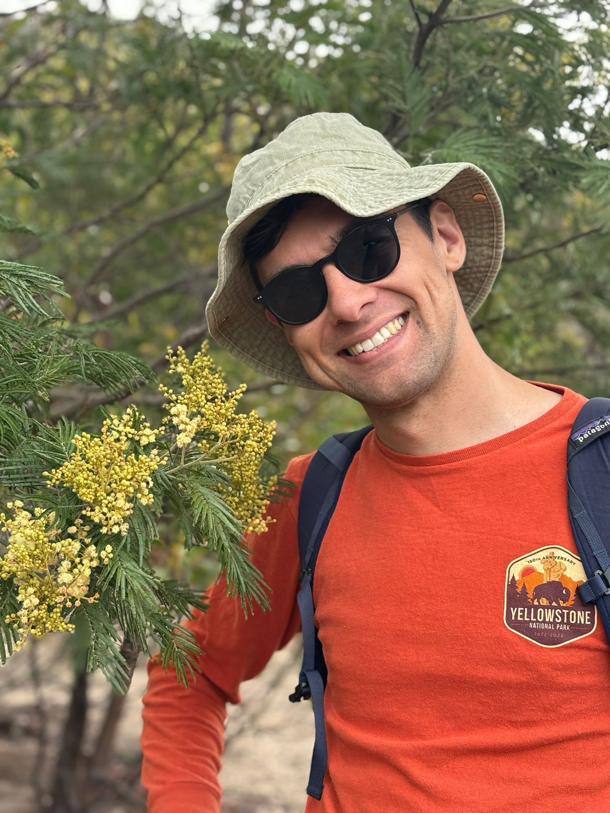

@def title = "Damian Pavlyshyn"
@def hascode = true
@def hasmath = false
@def hasicons = true

~~~

  

    
    

    I'm Damian, a fifth-year PhD student in Stanford's Statistics department, advised by <a href="https://imjohnstone.su.domains//">Iain Johnstone</a>.
    I will be graduating on June 13 2022, and am currently applying for jobs as a statistician in the industrial sector.
    

    

    I am interested in problems of testing and estimation arising from high-dimensional statistics.
	My research has been focused on random matrix theory, and is pertains to PCA and factor analysis in high dimensions.
    

    

    You can find me on <a href="https://github.com/damian-t-p">Github</a>, <a href="https://linkedin.com/in/d-pavlyshyn
">Linkedin</a>  or email me at <code>damian.pavlyshyn@gmail.com</code>. A copy of my CV is available here: 
	
		<a href="/assets/cv/dpavlyshyn-cv.pdf"><i class="ai ai-cv ai-lg"></i></a>
		Locally-hosted file
	
    

    

      
  

~~~
